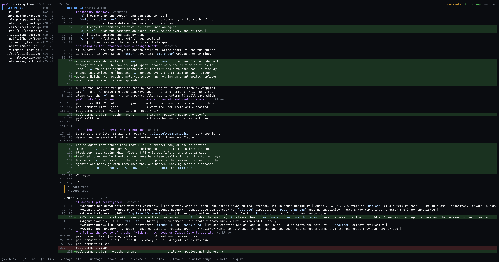

# peel

A terminal diff reviewer that stages what you just reviewed.

Every local diff-review tool is read-only, so reviewing and `git add` end up as
two separate passes over the same diff: you read it in a viewer, then walk the
whole thing again in the terminal, re-deciding what you decided five minutes ago.

`peel` is one pass. Read a file, press `s`, and it is staged, folded away, and the
next file is in front of you — what is left open is what is left to review.
Comments you leave land in a store Claude Code can read, so "address my review
comments" needs no copy-paste.



The file list on the left is the review queue and a `✓` marks a staged file. The
footer is the whole keymap.

## Install

```sh
make install          # builds and installs to /opt/homebrew/bin
go build -o peel .    # or just build it here
```

`make install` also symlinks the Claude Code skill into `~/.claude/skills/peel-review`,
so edits to `skills/peel-review` are live without reinstalling. `make install-skill`
does only that half, and `make uninstall` removes both. `PREFIX` and `SKILLS` move
either destination.

Go 1.26+, one static binary, no runtime. `gh` is required for PR mode; either
`claude` or `codex` can write walkthroughs. `peel providers` shows what is
available.

## Use

```sh
peel                      # review the working tree
peel --rev HEAD~2         # review everything since a commit (read-only)
peel --pr 412             # review a GitHub PR (read-only)
peel --no-watch           # don't re-read the repository while open
peel --provider codex     # use Codex for the walkthrough instead of Claude
```

`--rev` moves the base of the diff back without changing what is on the other
side of it: `peel --rev HEAD~2` is the last two commits *and* whatever is still
uncommitted, as one diff. Anything git resolves to a commit works — `HEAD~2`, a
hash, a branch, `origin/main` to read your whole branch back. The base is pinned
when the session opens, so a commit landing while you read cannot slide the diff
out from under you.

Those sessions are read-only, because HEAD is the only base staging means
anything against: a file whose change is half committed cannot be `git add`ed
into the shape on screen. Commenting, walkthroughs and follow mode all work as
usual — the far side is still the live working tree, so it keeps up as the
repository changes.

### Keys

| Key | Action |
|---|---|
| `↓` / `↑` | move the cursor one line, diff body included |
| `j` / `k` | next / previous hunk, file or comment |
| `]` / `[` | next / previous file |
| `}` / `{` | scroll the file list on its own |
| `h` / `l` | scroll the code sideways, for a line too long for the pane |
| `0` / `$` | back to the first column / out to the longest line's end |
| `b` | hide or show the file list, giving the diff the whole width |
| `space` | fold the file away and move on, or expand it again — and folds a walkthrough note away |
| `s` | stage the file the cursor is in, folding it away and moving to the next |
| `u` | unstage that file, opening it again |
| `a` / `U` | stage everything / unstage everything |
| `o` | open the file the cursor is in, outside peel |
| `c` | comment at the cursor, changed line or not |
| `enter` / `alt+enter` | in the editor: save the comment / write another line |
| `x` / `D` | resolve / delete the comment at the cursor |
| `C` | copy the comments as text, to paste into an agent |
| `A` / `X` | hide the comments an agent left / delete every one of them |
| `\` | toggle unified and side-by-side |
| `w` / `W` | walkthrough on-off / regenerate it |
| `f` | follow: re-read the repository as it changes |
| `r` | reload from git |
| `?` / `q` | help / quit |

There is one cursor and it rests anywhere — file headers, hunk headers, comments,
and every line of a diff body, changed or not. Nothing to enter first: `s`
anywhere inside a file stages that file, `c` anywhere leaves a note there,
including on the untouched code a change breaks.

`c` opens the editor inline, in the diff, exactly where the comment will sit once
it is saved — the code stays on screen while you write about it, and the cursor
is still on it afterwards. `enter` saves it; `alt+enter` writes another line.

A comment says who wrote it: `user:` for yours, `agent:` for one Claude Code left
through the skill. The two are kept apart because only one of them is yours to
lose — `A` takes the agent's notes out of the diff and puts them back, a display
change that writes nothing, and `X` deletes every one of them at once, after
asking. Neither can reach a note you wrote, and nothing an agent writes replaces
one: comments are only ever appended.

A line too long for the pane is read by scrolling to it rather than by wrapping
it: `h` and `l` slide the code sideways under the line numbers, which stay put
along with the `+` and `-`, so a row scrolled out to column 90 still says which
line it is and whether it was added. `$` goes out to the end of the longest line
in the diff and `0` comes back. The header names the column while you are away
from the first one.

The mouse works too. The wheel scrolls whichever pane it is over and drags the
cursor along, so the cursor never addresses a row that has left the screen. A
horizontal wheel — a two-finger swipe, or shift and the wheel — slides the code,
in terminals that report one: Ghostty, kitty, iTerm2, WezTerm and Alacritty all
do. Where yours does not, or swallows the swipe for its own scrollback, `h` and
`l` do the same thing.

### Staging is whole-file

A file is the unit a review decision is actually made in, so that is the unit
peel stages: `git add` and `git restore --staged`, one path at a time. No patch
generation, so none of `git add -p`'s failure modes — nothing here can write the
wrong lines into your index. If you want to split a file, `git add -p` already
does that well.

Staging collapses the file and moves the cursor to the next file still to review,
so a pass is `s` after `s` and never a jump back to find where you were. Files
you have already staged or folded are passed over on the way, since they have
been dealt with; only when nothing below is still open does the cursor stay on
what you just staged. The fold
is display only: `space` reads a staged file back without touching the index, and a
stage that fails leaves the file open, and the cursor on it, because it still has
to be dealt with.

The fold and the move happen on the keypress, before git has been asked anything —
as does a note appearing in the diff, and a comment resolving. None of it is in
doubt, only slow: `git add` and the re-read behind it are a few hundred
milliseconds in a large repository, and waiting for them before redrawing makes a
decision you have already made look like peel thinking about it. The write goes on
behind the screen and the re-read confirms it; if it fails, the change comes back
off and the footer says why. `q` straight after `s` waits for that stage to land.

`space` does the same thing without the index. Not every file you read is a file
to stage — a `--rev` or pull request session cannot stage at all, and a working
tree has files you look at and leave alone — so folding one away moves you on to
the next exactly as staging does. What is left open is what is left to read.

Folds are remembered between runs, in `.git/peel/folds.json` and per review, so a
pass through a large diff picks up where you left it instead of starting again
from the top. A file whose change has been committed away loses its fold: the
next change to it is a new thing to read, not something to hide.

### Walkthrough

`w` asks Claude Code (or Codex) to walk you through the change, and the result is
not a separate pane — the diff itself is reordered into the steps the narrative
reads it in, with each step's explanation above the files it covers. So you read
the notes and the code together. `j`/`k` stop on a note like they stop on a hunk,
`space` folds one away once you have read it, `w` again puts the diff back in git's
order, and `W` writes a new one. Staging keeps the notes; when the code moves on
underneath them the header says `stale`.

Walkthroughs are cached in `.git/peel/`, so reopening does not pay for one twice.

## For agents

`peel hunks list` and `peel comment` are the agent surface, documented for Claude
Code in [`skills/peel-review`](skills/peel-review/SKILL.md).

```sh
peel hunks list --json                  # what changed, and what is staged
peel --rev HEAD~2 hunks list --json     # the same, measured from an older base
peel comment list --json                # what the user wrote while reading
peel comment add --file F --line N --body "..."
peel comment clear --author agent       # its own review, never the user's
peel walkthrough                        # the cached narrative, as markdown
```

Two things it deliberately will not do:

- **Stage.** `peel hunks add`/`stage`/`unstage` refuse. Staging is a decision made
  against a file someone just read, in the UI. Anything scripting git can call
  `git add` directly, so exposing it here would only add a way for changes to
  reach the index unreviewed.
- **Post anything.** `peel pr submit` is the only command that leaves the machine.
  It prints the exact payload, then waits for an explicit `y`.

Comments are written straight through to `.git/peel/comments.json`, so there is no
daemon and no session to attach to: review, quit, *then* ask Claude.

For an agent that cannot read that file — a browser tab, or one on another
machine — `C` puts the review on the clipboard as text to paste into it: one
block per note, saying which file and line it was left on and what it says.
Resolved notes are left out, since those have been dealt with, and the footer says
how many. `A` narrows it further: what `C` copies is the review on screen, so the
agent's own notes go with them when they are hidden. Copying needs a clipboard
tool on `PATH` — `pbcopy`, `wl-copy`, `xclip`, `xsel` or `clip.exe`.

## Layout

```
internal/git       diff parsing, status, and whole-file staging
internal/store     comments, folds, and the walkthrough cache, under .git/peel/
internal/ai        walkthrough providers (claude-code, codex)
internal/forge     pull request providers (github, via gh)
internal/registry  provider lookup, shared by both
internal/app       wiring; the only package that names concrete providers
internal/cli       the agent-facing command surface
internal/tui       the review UI
```

`internal/git` never imports `internal/tui` — navigation and rendering are
testable without a terminal, and the git layer stays reusable.

See [SPEC.md](SPEC.md) for the design and the reasoning behind each decision,
including the ones that were reversed.
