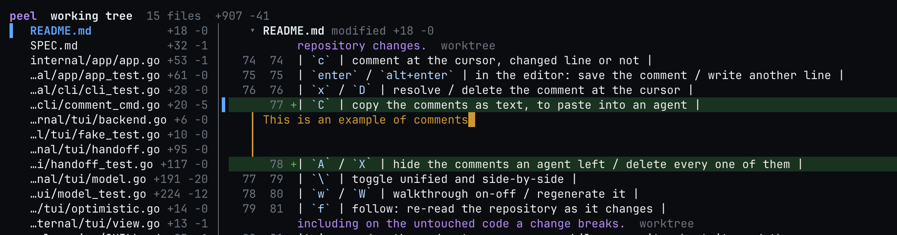

# peel

A terminal diff reviewer that stages what you just reviewed.

Every local diff-review tool is read-only, so reviewing and `git add` end up as
two separate passes over the same diff: you read it in a viewer, then walk the
whole thing again in the terminal, re-deciding what you decided five minutes ago.

`peel` is one pass. Read a file, press `s`, and it is staged, folded away, and the
next file is in front of you — what is left open is what is left to review.


The file tree on the left is the review queue and a `✓` marks a staged file — or
a whole directory once every file in it is staged. The footer is the whole
keymap.

- **Staging is the review.** `s` stages a file and moves you to the next one still
  open, so a pass is `s` after `s`. Whole files only — no patch generation, so
  nothing here can write the wrong lines into your index.
- **Comment where the code is.** `c` anywhere — changed line or not — opens the
  editor inline, in the diff, at the spot the note will sit.
- **Notes keep up with the code.** Each note freezes the file it was written
  against as a git object, so when an agent edits above it the note moves with
  its line instead of staying on a number. Code that has been rewritten out from
  under a note is not guessed at: the note says `outdated` and shows where it
  was.
- **Half staged reads as half staged.** A file git holds in the index *and* the
  working tree is drawn as two halves under their own headings, the staged one
  folded away, so what you scroll is what you have not reviewed. Change a file
  after staging it and it opens again, on the new work alone.
- **Notes an agent can read.** Comments go to a JSON file — `.git/peel/comments.json`
  for the working tree — which Claude Code reads through the bundled skill, so
  "address my review comments" needs no copy-paste. `C` copies your own as text
  for an agent that cannot.
- **A walkthrough in the diff.** `w` reorders the diff into the steps an AI
  narrative reads it in, each explanation above the code it covers.
- **It keeps up.** Follow mode re-reads the repository as it changes, and the
  screen moves on the keypress rather than waiting for git.
- **Read-only bases.** `--rev` reviews further back than HEAD, `--pr` reviews a
  GitHub pull request — from any checkout, or none at all.
- **A pull request's review follows the pull request.** Its notes, folds and
  narrative are filed under `#412` rather than inside one clone, so you can pick
  the pass back up anywhere. `P` posts it: a summary, approve or request changes
  or comment, and one last question before anything leaves the machine.

## Install

```sh
brew install ziadalzarka/tap/peel
```

The skill ships inside the keg rather than in your skills directory, so link it
once and Claude Code can read your review comments:

```sh
ln -sfn "$(brew --prefix peel)/libexec/skills/peel-review" ~/.claude/skills/peel-review
```

From a checkout instead:

```sh
make install          # builds and installs to /opt/homebrew/bin
go build -o peel .    # or just build it here
```

`make install` also symlinks the Claude Code skill into `~/.claude/skills/peel-review`,
so edits to `skills/peel-review` are live without reinstalling. `make install-skill`
does only that half, and `make uninstall` removes both. `PREFIX` and `SKILLS` move
either destination.

Go 1.26+, one static binary, no runtime. `gh` is required for PR mode; either
`claude` or `codex` can write walkthroughs. `peel providers` shows what is
available.

peel looks for a newer release while you review and tells you once you have
quit, with the command that installs it:

```
peel v0.5.0 is out — you have v0.4.0
  brew upgrade ziadalzarka/tap/peel
```

That check is the only thing peel sends anywhere on its own — one unauthenticated
request to the GitHub releases API, asked at most once a day and never by a build
made from a checkout. `PEEL_NO_UPDATE_CHECK=1` turns it off.

## Use

```sh
peel                      # review the working tree
peel --rev HEAD~2         # review everything since a commit (read-only)
peel --pr 412             # review a GitHub PR (read-only)
peel --no-watch           # don't re-read the repository while open
peel --provider codex     # use Codex for the walkthrough instead of Claude
```

`--rev` moves the base of the diff back without changing what is on the other
side of it: `peel --rev HEAD~2` is the last two commits *and* whatever is still
uncommitted, as one diff. Anything git resolves to a commit works — `HEAD~2`, a
hash, a branch, `origin/main` to read your whole branch back. The base is pinned
when the session opens, so a commit landing while you read cannot slide the diff
out from under you.

Those sessions are read-only, because HEAD is the only base staging means
anything against: a file whose change is half committed cannot be `git add`ed
into the shape on screen. Commenting, walkthroughs and follow mode all work as
usual — the far side is still the live working tree, so it keeps up as the
repository changes.

### Keys

| Key | Action |
|---|---|
| `↓` / `↑` | move the cursor one line, diff body included |
| `j` / `k` | next / previous hunk, file or comment |
| `]` / `[` | ten lines down / up, stopping short at any heading on the way |
| `opt+↓` / `opt+↑` | next / previous file |
| `cmd+p` | go to a file by name, in the terminals that send `cmd` through |
| `}` / `{` | scroll the file tree on its own |
| `h` / `l` | scroll the code sideways, for a line too long for the pane |
| `0` / `$` | back to the first column / out to the longest line's end |
| `b` | hide or show the file tree, giving the diff the whole width |
| `space` | fold away the file, the half already staged, or a walkthrough note — or open it again |
| `space` on a `▴`/`▾` row | read in twenty more lines of the code the diff left out |
| `s` | stage the file the cursor is in, folding it away and moving to the next |
| `u` | unstage that file, opening it again |
| `a` / `U` | stage everything / unstage everything |
| `o` | open the file the cursor is in, outside peel — in the editor you configure |
| `shift+↓` / `shift+↑` | mark a run of lines to write one note about — any other key lets it go |
| `c` | comment at the cursor, or on the run of lines marked |
| `enter` / `shift+enter` | in the editor: save the comment / write another line |
| `e` | edit a comment of your own, where it stands |
| `x` / `D` | resolve / delete the comment at the cursor |
| `C` | copy your own comments as text, to paste into an agent |
| `A` / `X` | hide the comments an agent left / delete every one of them |
| `P` | post the review to the pull request: a summary, then approve / request changes / comment |
| `\` | toggle unified and side-by-side |
| `w` / `W` | walkthrough on-off / regenerate it |
| `f` | follow: re-read the repository as it changes |
| `r` | reload from git |
| `?` / `q` | help / quit |

There is one cursor and it rests anywhere — file headers, hunk headers, comments,
and every line of a diff body, changed or not. Nothing to enter first: `s`
anywhere inside a file stages that file, `c` anywhere leaves a note there,
including on the untouched code a change breaks.

### Reading past the hunk

`git diff` prints three lines either side of a change, which is rarely enough to
tell whether the change is right. Wherever it stopped, peel says how much it left
out — `▾ 38 lines hidden` under a hunk, `▴ 38 lines hidden` over the next one —
and `space` on that row reads twenty of them in from that end. Press it again for
twenty more, until the arrow goes and the code runs continuously from one hunk to
the next. Everything works on the code that arrives the way it works on the rest:
`c` leaves a note on it, side-by-side pairs it, and the line numbers are the
file's own.

### Comments

`c` opens the editor inline, in the diff, exactly where the comment will sit once
it is saved — the code stays on screen while you write about it, and the cursor
is still on it afterwards. `enter` saves it; `shift+enter` writes another line,
and `alt+enter` does the same in a terminal that sends shift+enter as a plain
enter.

`e` on a note of your own opens the same editor holding what the note says, in
the note's own place — a comment is corrected where it stands rather than deleted
and written again. Emptying it does not delete it; `D` is that key. The agent's
notes are its own: they can be resolved, answered or deleted, not rewritten.

A note can be about more than one line. `shift` with `↓` or `↑` takes the next
line into a run and carries the cursor with it — reversing the arrow gives a line
back — and `c` then writes one note about all of it, stored with both ends and
read back as `alpha.go:12-16`. Nothing has to be cancelled: the run is let go of
by carrying on, since every key that is not extending it or writing its note is
you moving on.



Side by side, a note hangs under the half of the row that holds the line it is
about — the new side, or the old side for a note on a line the change took away —
and the editor opens in that column too, so what you write stands where it will
be read.

A note on a file that is half staged records which half it was left on as well as
which line, so it comes back where you wrote it instead of on the same number in
the other diff — and what an agent reads, through the skill or through `C`, says
which copy of the file that number counts against.

A comment says who wrote it: `user:` for yours, `agent:` for one Claude Code left
through the skill. The two are kept apart because only one of them is yours to
lose — `A` takes the agent's notes out of the diff and puts them back, a display
change that deletes nothing, and `X` deletes every one of them at once, after
asking. Neither can reach a note you wrote, and nothing an agent writes replaces
one: comments are only ever appended.

Which of the two `A` was left on is remembered between runs, with the rest of
that review's state — `.git/peel/view.json` for the working tree — so a diff you read without the agent's
review does not have it back the next morning. The header says `agent hidden`
for as long as it is, and a review with no agent notes in it opens plain
whatever was written down — there is nothing to take out.

### Opening a file

`o` opens the file the cursor is in outside peel, for when the diff is not enough
and the whole file has to be read — or edited. What it opens with is git config,
so it is set once and every repository has it:

```sh
git config --global peel.open zed          # everything
git config --global peel.open.md open      # except markdown, to the desktop
git config --global peel.open.png "qlmanage -p"
```

`peel.open.<extension>` wins for that kind of file, `peel.open` covers the rest,
and with neither set peel hands the file to `open`, the way double clicking it
would. Setting it in a repository instead of `--global` narrows it to that one.

The value is a command and its arguments, split on spaces and run directly —
`open -a Marked` works, and nothing here reaches a shell. The file goes on the
end as an absolute path. Config is read on each `o`, so changing it takes effect
in the session already open.

### Long lines and the mouse

A line too long for the pane is read by scrolling to it rather than by wrapping
it: `h` and `l` slide the code sideways under the line numbers, which stay put
along with the `+` and `-`. `$` goes out to the end of the longest line and `0`
comes back; the header names the column while you are away from the first one.

The wheel scrolls whichever pane it is over and drags the cursor along, so the
cursor never addresses a row that has left the screen. A horizontal wheel — a
two-finger swipe, or shift and the wheel — slides the code, in terminals that
report one: Ghostty, kitty, iTerm2, WezTerm and Alacritty all do. Where yours
does not, `h` and `l` do the same thing.

### Staging is whole-file

A file is the unit a review decision is actually made in, so that is the unit
peel stages: `git add` and `git restore --staged`, one path at a time. If you
want to split a file, `git add -p` already does that well.

A file staged in part elsewhere — `git add -p`, or an edit made after `s` — is in
both of git's diffs at once, and peel draws it as both: two halves under their own
headings, with the file header counting each one separately. The staged half opens
folded, because it has been read already, so what is left on screen is what is left
to review; `space` on its heading reads it back. Edit a file after staging it and
it unfolds on its own, on the new work alone — which happens only to a file folded
because it was staged, never to one you folded by hand.

Staging collapses the file and moves the cursor to the next one still open, never
back to find where you were. Folded files are passed over on the way, since they
have been read already; a file staged elsewhere but never folded here is not, its
diff is still on screen to read. Only when nothing below is still open does the
cursor stay put. The fold is display only: `space` reads a staged
file back without touching the index, and a stage that fails leaves the file
open, and the cursor on it, because it still has to be dealt with.

The fold and the move happen on the keypress, before git has been asked anything —
as does a note appearing in the diff, and a comment resolving. None of it is in
doubt, only slow: `git add` and the re-read behind it are a few hundred
milliseconds in a large repository, and waiting for them before redrawing makes a
decision you have already made look like peel thinking about it. The write goes on
behind the screen and the re-read confirms it; if it fails, the change comes back
off and the footer says why. `q` straight after `s` waits for that stage to land.

`space` does the same thing without the index. Not every file you read is a file
to stage — a `--rev` or pull request session cannot stage at all, and a working
tree has files you look at and leave alone — so folding one away moves you on to
the next exactly as staging does. What is left open is what is left to read. On the
heading of a half it folds that half instead, leaving the rest of the file where it
is.

Folds are remembered between runs, per review — in `.git/peel/folds.json` for the
working tree — so a
pass through a large diff picks up where you left it instead of starting again
from the top. A file whose change has been committed away loses its fold: the
next change to it is a new thing to read, not something to hide. A half's fold is
not written down — the staged one starts folded every session, since being in the
index already says it has been reviewed.

### Walkthrough

`w` asks Claude Code (or Codex) to walk you through the change, and the result is
not a separate pane — the diff itself is reordered into the steps the narrative
reads it in, with each step's explanation above the files it covers. So you read
the notes and the code together. `j`/`k` stop on a note like they stop on a hunk,
`space` folds one away once you have read it, `w` again puts the diff back in git's
order, and `W` writes a new one. Staging keeps the notes; when the code moves on
underneath them the header says `stale`.

Walkthroughs are cached with the rest of the review's state — in `.git/peel/` for
the working tree — so reopening does not pay for one twice.

### Pull requests

`peel --pr 412` reads a pull request through `gh`: a number resolves against the
repository you are standing in, and `owner/repo#412` or a URL names one directly.
That form needs no repository at all, so a pull request can be read from any
directory.

A pull request is the same pull request from every clone, so its review is not
kept inside one. The notes, the folds, the `A` filter and the cached walkthrough
all live in a file named after the pull request itself:

```
~/.local/state/peel/reviews/github/cli/cli/412.json
```

`$PEEL_STATE_DIR` moves that directory, and `$XDG_STATE_HOME` moves it the way it
moves everything else. Start reading #412 in one worktree, carry on in another
clone tomorrow, and it is the same pass with the same notes still on it. The
working tree's own review stays in `.git/peel`, since it means nothing anywhere
else. Notes written on a pull request before this — the ones stranded in some
checkout's `.git/peel` — are moved into the pull request's file the next time you
open it from that checkout.

`P` posts the review. It asks for a summary, then what the review does — `a`
approve, `r` request changes, `c` comment — and then the last question, which
says how many notes are about to go where:

```
post 6 comments to cli/cli#412 as request changes?
```

Only `y` sends it. What goes is every unresolved note on the review, and posting
resolves them: they are the other side's to answer now. A note left on a file
rather than a line has nowhere inline to attach, so the panel says it is staying
behind. `peel pr submit` does the same thing from the command line, and prints
the whole payload before it asks.

## For agents

`peel hunks list` and `peel comment` are the agent surface, documented for Claude
Code in [`skills/peel-review`](skills/peel-review/SKILL.md).

```sh
peel hunks list --json                  # what changed, and what is staged
peel --rev HEAD~2 hunks list --json     # the same, measured from an older base
peel comment list --json                # what the user wrote while reading
peel comment add --file F --line N --body "..."
peel comment clear --author agent       # its own review, never the user's
peel walkthrough                        # the cached narrative, as markdown
```

Two things it deliberately will not do:

- **Stage.** `peel hunks add`/`stage`/`unstage` refuse. Staging is a decision made
  against a file someone just read, in the UI. Anything scripting git can call
  `git add` directly, so exposing it here would only add a way for changes to
  reach the index unreviewed.
- **Post anything.** `peel pr submit` is the only command that leaves the machine.
  It prints the exact payload, then waits for an explicit `y`. `P` in the UI is
  the same operation with the same last question, pressed by a person.

Comments are written straight through to their review's own file — the working
tree's in `.git/peel/comments.json`, a pull request's under the state directory
— so there is no daemon and no session to attach to: review, quit, *then* ask
Claude. An agent reads a pull request's notes with `peel --pr <ref> comment
list`, since that is what says which review is being asked about.

For an agent that cannot read that file — a browser tab, or one on another
machine — `C` puts the review on the clipboard as text to paste into it: one
block per note, saying which file and line it was left on and what it says. What
it hands over is the review *you* wrote — an agent's own notes are what a review
was already given for, so they are never copied, hidden or not. Resolved notes
are left out too, since those have been dealt with, and the footer says how many.
Copying needs a clipboard tool on `PATH` — `pbcopy`, `wl-copy`, `xclip`, `xsel`
or `clip.exe`.

## Layout

```
internal/git       diff parsing, status, and whole-file staging
internal/store     comments, folds, views, and the walkthrough cache — in .git/peel/
                   for the working tree, one file per pull request outside it
internal/ai        walkthrough providers (claude-code, codex)
internal/forge     pull request providers (github, via gh)
internal/registry  provider lookup, shared by both
internal/update    the release check, and the only thing peel sends unasked
internal/app       wiring; the only package that names concrete providers
internal/cli       the agent-facing command surface
internal/tui       the review UI
```

`internal/git` never imports `internal/tui` — navigation and rendering are
testable without a terminal, and the git layer stays reusable.

## Release

Tag a version and push the tag. CI runs the tests, cross-compiles darwin and
linux for both architectures, publishes the archives with a checksum file, and
bumps the formula in
[ziadalzarka/homebrew-tap](https://github.com/ziadalzarka/homebrew-tap).

```sh
git tag v0.1.0
git push origin v0.1.0
```

Nothing about that is CI-only: `make dist VERSION=v0.1.0` writes the same four
archives, and `.github/scripts/formula.sh v0.1.0 dist` prints the formula they
produce, so a release can be read before it is tagged. Pushing to the tap needs a
`HOMEBREW_TAP_TOKEN` secret — a fine-grained token with contents write on the tap
repository, and the only thing the release cannot do for itself.

See [SPEC.md](SPEC.md) for the design and the reasoning behind each decision,
including the ones that were reversed.
